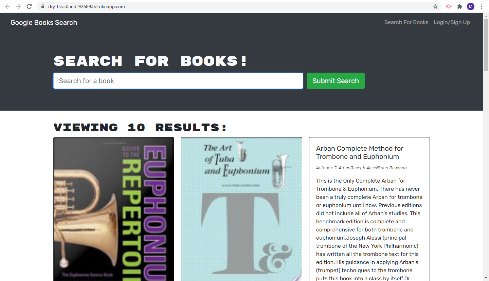

 
  # Book_search
  

  ## Table of Contents
  * [Description](#description)
  * [Install](#install)
  * [Use](#use)
  * [License](#license)
  * [Contributing](#contributing)
  * [Tests](#tests)
  * [Questions](#questions)

  ## Description
  This website is a full stack MERN website that  acts as a digital library where users can create accounts to search through Google books and add and remove them from a saved list.  
    

  [Deployed Site](https://book-search-92689.herokuapp.com/)

  ## Install
  Download the files and install the node package dependencies with "npm install". Use the command "npm run develop" to run the website in development mode.
  
  ## License
  No license.

  ## Contributing
  

  ## Tests
  No tests were created.
  
  ## Questions
  - [Github for mattersievers](http://www.github.com/mattersievers)
  - For further questions, contact me through email at mattersievers@gmail.com

